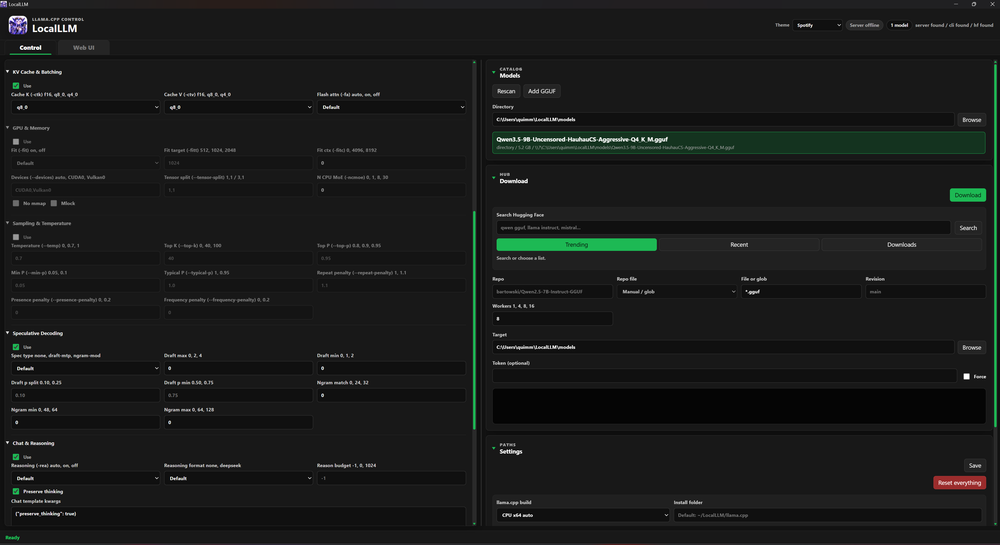

# LocalLLM


LocalLLM is a lightweight Tauri desktop control panel for running
`llama.cpp` locally. It helps you discover GGUF models, configure
`llama-server`, preview the launch command, save per-model presets, and open
the local Web UI.

## App Preview



## Features

- Discover `llama-server`, `llama-cli`, `hf`, and `huggingface-cli` from `PATH`.
- Install supported prebuilt `llama.cpp` Windows and Ubuntu Linux release assets from inside the app.
- Save executable paths, model directory, manual GGUF entries, and server defaults.
- Scan a model directory recursively for `.gguf` files.
- Add manually selected `.gguf` files outside the model directory.
- Download GGUF files from Hugging Face through `hf download`.
- Preview the exact `llama-server` command before launch.
- Explain the active command in a compact helper below the preview.
- Estimate VRAM from GGUF metadata when available.
- Configure runtime, KV cache, GPU/memory, sampling, speculative decoding,
  chat/reasoning, multimodal, Jinja, tools, embeddings, and verbosity options.
- Save per-model presets and automatically return to the selected model's own preset when changing models.
- Start, stop, and open the local llama.cpp server.
- Run `llama-server` hidden in the background with log capture, or in a visible terminal.
- Warn before starting when another background `llama-server` process is already running.
- Reset LocalLLM's saved settings/cache without deleting downloaded models.

## Runtime Requirements

The built app does not require Node.js or Python to run.

You only need the tools you want LocalLLM to control:

- `llama-server` is required to serve models.
- `llama-cli` is optional.
- `hf` or `huggingface-cli` is optional for Hugging Face downloads. LocalLLM can use `curl` for a single selected file, but glob patterns such as `*.gguf` need the Hugging Face CLI.
- GGUF model files.

On Windows and Ubuntu-based Linux distributions, the app installs prebuilt
official `llama.cpp` release assets from the Settings panel. Ubuntu Linux
installs use the official `*-bin-ubuntu-*.tar.gz` packages and require `curl`
and `tar` on `PATH`; LocalLLM does not compile `llama.cpp` from source. You can
also browse to your own `llama-server` and `llama-cli` binaries.

## How To Use

1. Open LocalLLM.
2. In **Settings**, set or install `llama.cpp`.
3. Set the model directory where your `.gguf` files live.
4. Press **Rescan** to load models.
5. Pick a model from the model dropdown or model list.
6. Adjust runtime options and presets.
7. Press **Start**.
8. Press **WebUI** or switch to the Web UI tab after the server starts.

Useful controls:

- **New Preset** resets the current model preset to a clean default configuration.
- **Profile editor** lets you create, save, select, and delete presets.
- **Tools all**, **Jinja**, **Embeddings**, and **Verbose** are quick toggles near Extra args.
- **Extra args** is appended to the generated `llama-server` command.
- **Reset everything** in Settings clears LocalLLM settings, presets, cache, logs,
  theme, and layout. It does not delete GGUF files or your llama.cpp install.

## Development Setup

Install:

- Node.js 20 or newer
- Rust stable
- Tauri prerequisites for your OS

Install JavaScript dependencies:

```sh
npm install
```

Run in development mode:

```sh
npm run tauri dev
```

Run the frontend-only build:

```sh
npm run build
```

Run the current UI regression test:

```sh
npm run test:model-selection
```

## Build Release

Build for the current operating system:

```sh
npm run tauri build
```

Windows bundles are written to:

- `src-tauri/target/release/localllm.exe`
- `src-tauri/target/release/bundle/nsis/`
- `src-tauri/target/release/bundle/msi/`

Linux and macOS builds should be produced on their native operating systems or
with CI runners for those systems. Tauri desktop bundles are OS-specific.

## Linux Build Notes

Install Node.js, Rust, and Tauri's Linux system dependencies. On Ubuntu/Debian,
the dependency list depends on your distro version, but commonly includes
WebKitGTK, GTK, AppIndicator, librsvg, curl, wget, and build tools.

Then run:

```bash
npm install
npm run tauri build
```

Linux artifacts are produced under `src-tauri/target/release/bundle/`.

## macOS Build Notes

Build on macOS with Xcode Command Line Tools installed:

```bash
npm install
npm run tauri build
```

macOS artifacts are produced under `src-tauri/target/release/bundle/`.

## Repository Notes

Generated folders such as `node_modules`, `dist`, and `src-tauri/target` are
ignored and should not be committed.
